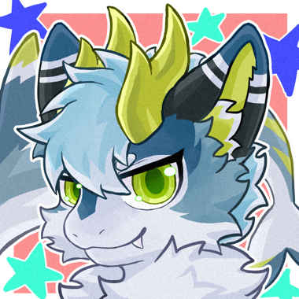

<h1 align="center">Hi, I'm Andy~</h1>

  

  <b>Software Engineering Undergraduate | Vibe Coding All Stack Development | LLM Applications | Computer Vision</b>

  
  
  

---

### About Me

目前是软工本科在读大学牲一枚~项目经历主要有大语言模型应用、垂直领域知识问答、时序预测、校园数字化系统研发。

- 目前聚焦：`LLM + RAG`、`Text2SQL`、`LoRA / SFT`、`Spring Boot` 后端开发、`Vue3` 前端工程
- 项目经历：水质预测预警模型调优、学院竞赛管理系统、车辆零部件缺陷视觉检测系统、学院毕设管理系统、WaterQA 水利智能问答平台

Code, coffee, and a little furry energy.

  

---

### Tech Stack

  
  
  
  
  

  
  
  
  
  
  

  
  
  

---

### Featured Work

| Project | Role | What I Built |
| --- | --- | --- |
| **WaterQA: LLM and RAG for Water Conservancy Safety QA** | Project Lead | Designed an integrated workflow for RAG retrieval, LoRA fine-tuning, Text2SQL, and knowledge-base management, enabling collaborative querying over unstructured documents and structured data. |
| **Computer College Competition Management System** | Main Developer | Built a full-process digital platform with Spring Boot, MyBatis-Plus, Vue3, and Element Plus, covering competition registration, team management, score entry, and award statistics. |
| **Vehicle Parts Defect Vision Detection System** | Core Member | Participated in industrial defect detection workflows based on deep learning, including data annotation, model training, and system design. |
| **Qiantang River Water Environment Prediction and Warning** | Research Lead | Built multi-source water-quality time-series datasets and explored long-sequence forecasting with Informer for pH, dissolved oxygen, COD, and warning-threshold linkage. |

---

### GitHub Activity

  
  

---

### Contact

- Email: [hzy50000@gmail.com](mailto:hzy50000@gmail.com)
- Telegram: [@DoctorAndy](https://t.me/DoctorAndy)
- X：`@AndyKaluosi`

> Building useful AI systems for real-world water conservancy, campus services, and industrial inspection.
